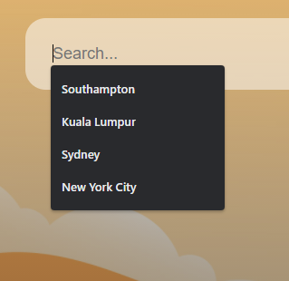
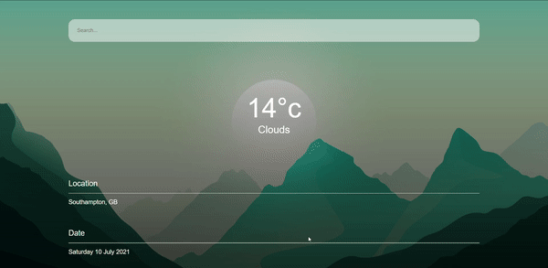
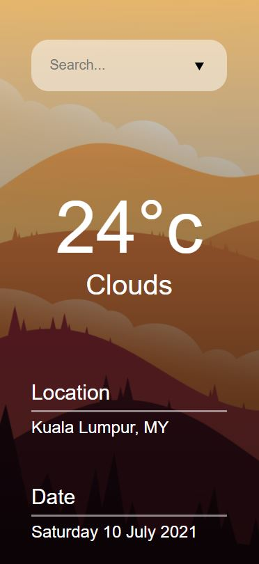

# Cloud Cover

A mobile first approach to developing this weather web app in React that fetch information from a weather API using the Fetch API to populate the DOM.

## Demo

The user could input any city in the world in the search bar at the top and the DOM will display the relevant weather information.  

A drop down menu provides suggestions of cities that the user could search for.  

The background image will change dynamically depending on the temperature of that specific city.

Cloud Cover is also responsive in all types of device screen sizes.  

## Features

- Fetch API
- React
- Responsive and dynamic
